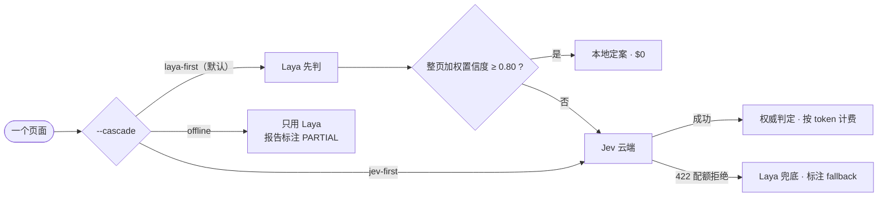
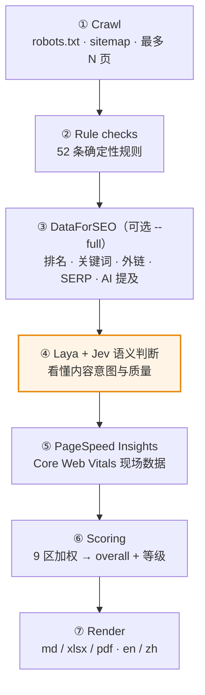

# laya-seo

**级联式网站 SEO 审计：本地 Laya 判别模型当闸门，Jev 云端模型当权威，人手当最后一道防线。**


> 从 [`jev-seo`](https://github.com/AgriciDaniel/jev-seo) 分叉而来。爬虫、52 项静态规则、
> PageSpeed、9 区评分与三种报告格式**全部保持原样**；只换了语义判断层——
> 从「一律问 Jev」改成「Laya 先判，置信度够就本地定案，不够才升级 Jev」。

---

## 目录

- [一、这是什么](#一这是什么)
- [二、60 秒快速上手](#二60-秒快速上手)
- [三、安装](#三安装)
- [四、用户手册导航](#四用户手册导航)
- [五、级联是怎么工作的](#五级联是怎么工作的)
- [六、供应商与端点配置](#六供应商与端点配置)
- [七、双语报告](#七双语报告)
- [八、已知局限（诚实清单）](#八已知局限诚实清单)
- [九、排错手册](#九排错手册)
- [十、测试](#十测试)
- [十一、项目结构](#十一项目结构)
- [十二、许可与署名](#十二许可与署名)

> 📘 **完整用户手册在 [`docs/USER-MANUAL.md`](docs/USER-MANUAL.md)**：
> 每条命令的完整参数、六种实战场景、成本估算、排错矩阵与 FAQ 都在那里。
> 本文件是它的门面与索引。

---

## 一、这是什么

### 一句话版本

给它一个网址，它还你一个**看得到出处、看得到证据的审计结论**：PDF / XLSX / Markdown 报告，
9 个分区打分，30 条左右按优先级排好的行动项，每条都带证据 URL、成本档和来源引擎。

### 它不是什么

| ❌ 不是 | ✅ 实际是 |
| --- | --- |
| 不是「AI 替你写 SEO 方案」 | 报告呈现**证据**，人工写叙述（`narrative.json`），自动摘要会明确标注是机器生成的 |
| 不是流量预测工具 | 没接 Google Analytics / Search Console，`--full` 的流量是 DataForSEO **估算值**，报告里明写 |
| 不是 Lighthouse 复刻 | 性能区是 PageSpeed 现场取数 + 抓取耗时兜底，拿不到就说拿不到（标记 `partial`） |
| 不是「本地模型替换云端模型」 | 这是**本篇全部价值的反面**——我们试过，失败率 50%，见[第五节](#五级联是怎么工作的) |

### 三个决定这个项目的判断

1. **本地判别模型当不了权威，但可以当闸门。** 实测 Laya 在 SEO 语义上零样本准确率 2/4，
   错误答案的置信度高达 0.962。所以：**它的置信度用来做路由决策，不用来做结论。**
2. **不仅要不错，还要能说出来「这句是谁说的」。** 每条判断都带 `origin`：
   `laya` / `jev` / `laya-fallback` / `code` / `rule`。XLSX 有 Engine 列可以逐条翻，
   Markdown 有专门的引擎披露段落。
3. **省下来的钱要能证伪。** `digest.md` 里每次运行都会写出真实的
   `laya_savings_ratio`、`jev_api.requests`、`jev_api.failed`。
   本文引用的所有实测数字都来自真实运行，包括**失败的那几次**。

---

## 二、60 秒快速上手

```bat
:: 1. 装
py -3.13 -m venv .venv
.venv\Scripts\pip install -r requirements.txt
.venv\Scripts\pip install laya

:: 2. 配。Laya 权重默认在 %USERPROFILE%\laya-models\laya，放别处就设 LAYA_MODEL_DIR
copy .env.example .env          :: 在里面填 TYPESAFE_API_KEY

:: 3. 体检 —— 依赖、权重、CUDA、密钥，绝不打印密钥值
bin\layaseo.cmd doctor

:: 4. 跑
bin\layaseo.cmd run https://example.com
```

输出落在 `laya-seo-reports\<domain>-<时间戳>\`：

```
laya-seo-reports\example-com-2026-10-05-0930\
├── audit.json        原始审计数据，所有报告都由它渲染
├── digest.md         给写报告的人看的结构化摘要
├── report.md         英文报告
├── report.xlsx       英文工作簿（8 张表，可编辑、带下拉状态）
├── report.pdf        PDF（需系统装 Pango，见第九节）
└── charts\*.png      17 张图表
```

**三种零花费的用法**（不爬站、不调 API、不加载模型）：

```bat
bin\layaseo.cmd render  laya-seo-reports\xxx --formats md,xlsx --lang zh   :: 重出报告
bin\layaseo.cmd rescore laya-seo-reports\xxx                              :: 重算分数
bin\layaseo.cmd audit   https://example.com --cascade offline             :: 纯本地 Laya
```

---

## 三、安装

### 3.1 环境要求

| 依赖 | 版本 | 必须？ | 说明 |
| --- | --- | --- | --- |
| Python | ≥ 3.10 | ✅ | 开发与实际运行均用 3.13 |
| `laya` Python 包 | 最新 | ⭕ | 不装则语义判断整体跳过，报告标 `PARTIAL AUDIT` |
| Laya 权重 | 615 MB | ⭕ | 默认 `~\laya-models\laya\multilingual`，可与其它本地 Agent 共用同一份 |
| NVIDIA GPU | — | ⭕ | CUDA 下单次推理约 1.5 秒；CPU 也能跑，慢 |
| MSYS2 / GTK3 Runtime | — | ⭕ | 只为 PDF 提供 Pango。**md 与 xlsx 不需要** |
| `TYPESAFE_API_KEY` | — | ⭕ | 没有则自动退化为 Laya 单引擎 |
| DataForSEO 账号 | — | ⭕ | 只在 `--full` 时收费 |

### 3.2 四步安装

```bat
:: ① 依赖
py -3.13 -m venv .venv
.venv\Scripts\pip install -r requirements.txt

:: ② Laya 运行时 —— 会自动带 torch。
::    Windows 上 pip 默认装的是 CPU 版，有 N 卡别急，③ 会修
.venv\Scripts\pip install laya

:: ③（有 NVIDIA GPU 时）换成 CUDA 版 torch，否则 ② 装的是 +cpu 版本
.venv\Scripts\pip install torch --index-url https://download.pytorch.org/whl/cu130

:: ④ Laya 权重默认位置：%USERPROFILE%\laya-models\laya\multilingual
::    放在别处就用环境变量指：set LAYA_MODEL_DIR=D:\models\laya

:: ⑤ 配置
copy .env.example .env
```

### 3.3 `.env` 怎么写

```ini
# 必填：没有就只能跑 offline 模式
TYPESAFE_API_KEY=sk-...

# 可选：提高 PageSpeed 限流额度（Google Cloud 免费申请）
PAGESPEED_API_KEY=

# 可选：只有 --full 才用（按次收费）
DATAFORSEO_USERNAME=
DATAFORSEO_PASSWORD=

# 可选：换成中转站 / 自部署端点（见第六节）
JEV_API_BASE=https://tokendance.space/gateway/typesafe/v1/systemone
JEV_MODEL=bocha-jev-v1
```

`.env` 已被 `.gitignore` 排除。`.env.example` 是模板。
`bin\layaseo.cmd` 会在启动 Python 之前把 `.env` 逐行读进环境变量——
因为端点和模型名是模块加载时就读取的，晚一步就改不动了。

### 3.4 体检：`doctor`

```bat
bin\layaseo.cmd doctor
```

它回答五个问题，**并且绝不打印你的密钥值**：Python 与依赖、Laya 运行时与权重、
CUDA 设备、三个密钥在不在、以及该用哪个模式。

```json
{
  "version": "0.1.2",
  "python": "3.13.12",
  "requests": "ok", "bs4": "ok", "lxml": "ok", "matplotlib": "ok",
  "openpyxl": "ok", "playwright": "ok",
  "weasyprint": "broken (OSError: cannot load library 'libgobject-2.0-0': error 0x7e)",
  "pdf": "unavailable: md and xlsx are unaffected",
  "laya": { "runtime": "ok", "weights": "ok", "device": "cuda",
            "torch": "2.14.1+cu130", "gpu": "NVIDIA GeForce RTX 4050 Laptop GPU",
            "model_dir": "C:\\Users\\...\\laya-models\\laya" },
  "TYPESAFE_API_KEY": "present",
  "available_modes": ["laya", "jev"],
  "recommended": "laya-first"
}
```

上面那份是**没装 Pango 的真机输出**——注意 `weasyprint` 那一行：
装了包但系统缺 DLL 时会标 `broken`（不是 `missing`），并落到 `pdf: unavailable`。
**md 与 xlsx 完全不受影响。**

> 顺带修了一个 bug：之前 `doctor` 遇到这种情况会直接崩掉。
> 体检工具自己崩是最没用的——现在它会把坏的原因写进报告。

`recommended` 是它替你选的模式：两者都在用 `laya-first`，只有本地权重用 `offline`，
都没有就得老实关掉语义判断。

---

## 四、用户手册导航

完整手册见 **[`docs/USER-MANUAL.md`](docs/USER-MANUAL.md)**。这里是索引：

| 想做什么 | 去哪儿看 |
| --- | --- |
| 命令与全部参数（含示例） | 手册 §2、§3 |
| 六个实战场景（客户交付 / 批量巡检 / 纯离线……） | 手册 §4 |
| 怎么读分数、看哪张表先 | 手册 §5 |
| 双语报告 `--lang` 的坑 | 手册 §6（也在[本文件第七节](#七双语报告)） |
| 写人工叙述 `narrative.json` | 手册 §7（合同见 `references/narrative.md`） |
| 花多少钱、怎么封顶 | 手册 §8 |
| 报错怎么办 | [本文件第九节](#九排错手册) + 手册 §9 |

### 4.1 五个命令一句话

| 命令 | 干什么 | 联网？ | 花钱？ |
| --- | --- | --- | --- |
| `doctor` | 检查依赖、权重、CUDA、密钥 | 否 | 否 |
| `audit <url>` | 爬 → 规则 → 语义判断 → PageSpeed → 打分，落 `audit.json` | 是 | Jev + 可选 PSI/DFS |
| `render <dir>` | 从已有 `audit.json` 出报告 | 否 | 否 |
| `run <url>` | `audit` + `render` 一步到位 | 是 | 同上 |
| `rescore <dir>` | 规则/打分逻辑更新后重算，不动原始数据 | 否 | 否 |

### 4.2 三个 `--cascade` 模式怎么选



- **`laya-first`（默认）** — 唯一真正省钱的路径。推荐日常使用。
- **`jev-first`** — 先问 Jev，全明确就不再跑 Laya。**仅供对照调试**，不省任何费用。
- **`offline`** — 彻底不联网不问 API，$0。代价是页面配对与关键词两项用不了，
  报告会带 `PARTIAL AUDIT` 提示语义判断为代理结果。

### 4.3 参数速查

最常用的 8 个，[全部 24 个见手册 §3](docs/USER-MANUAL.md#3-参数全表)：

| 参数 | 默认 | 一句话 |
| --- | --- | --- |
| `--max-pages` | `60` | 爬虫最多抓多少 URL |
| `--max-depth` | `5` | 距首页最多几跳 |
| `--cascade` | `laya-first` | 级联模式 |
| `--laya-page-accept` | `0.80` | 整页采信阈值。**调高更保守、更贵** |
| `--jev-budget` | `0.25` | Jev 花费硬顶，每次请求前检查 |
| `--lang` | `en` | `en` / `zh` / `both` |
| `--formats` | `pdf,xlsx,md` | 逗号分隔 |
| `--no-psi` | — | 跳过 PageSpeed（拿不到性能数据时会标 `partial`） |

---

## 五、级联是怎么工作的

### 5.1 七段流水线



橙色那一段是本项目改的地方，其余全部继承上游且未改动。

### 5.2 为什么不做「替换」而做「级联」

原始设想很朴素：Jev 要花钱，本地有个 Laya，换掉不就行了。**实测打脸。**

2026-10-04，在 4 个已知答案的中文 SEO 页面上测 Laya 零样本能力：

| 页面 | 正确答案 | Laya 判断 | 置信度 | |
| --- | --- | --- | --- | --- |
| 价格页 | `pricing` | `pricing` | 1.000 | ✅ |
| 文章页 | `article_or_guide` | **`homepage`** | **0.962** | ❌ |
| 产品页 | `product_or_service` | **`homepage`** | 0.642 | ❌ |
| 联系页 | `contact_or_location` | `contact_or_location` | 1.000 | ✅ |

**准确率 2/4，而且错误与高置信度正相关。** 文章页错判成 `homepage` 时还有 0.962，
稳稳越过上游的 `ACT=0.80` 阈值——意味着一旦替换，报告会把错误答案**当作确定结论**展示。

根因不是模型差：Laya 的权重训练于金融交易语料（state 是 OHLC + EMA + ATR），
迁移到 SEO 语义属于跨域零样本推断。**它可以当闸门，不能当权威。**

好消息是两者接口同构：都用 System One 原语 `choice` / `noul` / `score`，
`predict(state, questions)` 与 `POST /v1/systemone` 的字段几乎逐一对得上。
所以做级联是纯工程问题，不用重新训练模型。

完整实测数据与阈值依据 → [`references/cascade.md`](references/cascade.md)

### 5.3 三条设计铁律

1. **单题置信度达标不直接采信。** 实测证明 Laya 单题 0.962 也可能是错的，
   逐题 AND 挡不住。必须**整页加权平均**同时达标才本地定案。
2. **所有答案带 `origin` 标记。** 报告层必须能区分来源：XLSX 有 Engine 列，
   Markdown 有专门的引擎披露段落，`score.py` 的口径说明按实际引擎改写。
   读者不会误以为所有结论都出自生成式模型。
3. **阈值来自本项目实测，不照抄通用值。** `LAYA_Q_ACCEPT=0.95`、
   `LAYA_PAGE_ACCEPT=0.80` 都是被失败逼出来的，不是拍脑袋。

### 5.4 只有 `choice` 类参与采信判定

这是被实测逼出来的设计。Laya 的 `confidence` 字段在三种原语上表现完全不同：

| 原语 | 实测 confidence | 判定 |
| --- | --- | --- |
| `choice` | 1.000 / 0.962 / 0.642 —— **有区分度** | ✅ **参与采信** |
| `score` | `helpfulness` 报 0.075，但概率峰值落在正确答案 | 🔇 只记录，不参与 |
| `noul` | `noul=0.297`（判否）却报 confidence 0.703，**方向相反** | 🔇 只记录，不参与 |

早期版本把三类全纳入加权平均，结果节省率**恒为 0%**——`score` 题把整页均值拉到阈值以下，
每一页都被升级。这是本项目第一个真正的坑。

### 5.5 特殊分流

| 情况 | 去向 | 原因 |
| --- | --- | --- |
| 页面配对（内容重叠） | **强制 Jev** | Laya 在这项任务上置信度不可靠，不适用闸门 |
| state 超 2000 token | **强制升级 Jev** | Laya 会截断输入，截断后的分数不可信 |
| Jev 因配额被拒 | **退回 Laya 兜底** | 宁可给标注过的低置信结果，也不留空 |
| 「这是不是首页」 | **代码直接判定** | 已知答案，不让模型猜 |

### 5.6 送去 Laya 的 state 会被裁剪

Laya 上下文约 1024 token，Jev 宽松得多。实测中文真实页面在 6000 字符下
估算 1000–1546 token，**全部会被判定超长**，于是节省率又一次恒为 0。

送 Laya 之前裁剪（ `cli.py:_shrink_for_laya` ）：

| 字段 | 上限 |
| --- | --- |
| 正文 `text` | 1800 字符 |
| 大纲 `outline` | 前 12 项 |
| CTA 列表 | 前 8 项 |

Jev 拿到的是**未经裁剪**的完整 state —— 它上下文够长，不需要省。
`STATE_TOKEN_LIMIT` 也从 900 提到 2000，因为 900 连真实页面的零头都容不下。

### 5.7 实测表现

**`qinlinkeji.com`**（中文站，6 页，2026-10-04）：

```
Laya 本地定案 3–4 页，其余升级 Jev  ——  省去 50–67% 的 Jev 调用
Jev 10–17 次请求，$0.0043–0.0077
Laya 单次推理约 1.5–2 秒（RTX 4050 Laptop，CUDA）
overall 86–88 / 100，18 个行动项，not_judged 为空
```

**`duckwolf.cn`**（Discuz 论坛，13 个 URL / 7 个 HTML 页）— 这是一个**反面样本**，
正好说明闸门在起作用：

```
Laya 本地定案 0 页，5 页全部升级 Jev  ——  节省率 0%
overall 78 / 100（B），30 个行动项
content 57 · ai 71 · onpage 76 · crawl 81
links 91 · structured 91 · performance 93 · security 94
```

论坛页面普遍偏薄，Laya 拿不到足够信息，加权置信度上不了 0.80。
**这是正确行为，不是 bug**：本地模型不够确信，就交给权威模型，钱照花。

> 同一次运行还命中了供应商配额：Jev 15 次请求里 **4 次被 HTTP 422
> `token_budget_exceeded` 拒绝**，被拒页面退回 Laya 兜底，
> 最终 Engine 分布是 `Laya (fallback) 3 / Jev cloud 2`。
> 422 原文完整留在 `audit.json → jev.ledger.jev_api.errors`。
> 样例见 [`laya-seo-reports/duckwolf-cn/`](laya-seo-reports/duckwolf-cn/)。

---

## 六、供应商与端点配置

端点和模型名**可以改**，因为官方端点与中转站的 path 不一样：

```ini
JEV_API_BASE=https://tokendance.space/gateway/typesafe/v1/systemone
JEV_MODEL=bocha-jev-v1
```

留空则用官方 `https://api.typesafe.ai/v1/systemone` + `jev-latest`。
`doctor` 会回显实际生效的 `model_requested` / `model_returned`。

### 中转站的账号级配额 ⚠️

这是本项目最折腾的一个坑。中转站（tokendance.space）返回
`HTTP 422 token_budget_exceeded`：

| 一次请求里的题目数 | 结果 |
| --- | --- |
| 1 题 | ✅ OK |
| **2 题** | ✅ OK（`input_tokens` 32629） |
| 3 题起 | ❌ 422 |

关键是：响应里的 `counted_tokens` **恒为 34000 上下，跟这次发了几题无关**。
这说明限额来自**账号侧累计配额**，而不是单次请求体大小。于是我们能做的是：

- `DEFAULT_MAX_QUESTIONS = 2` —— 按 2 题一批**串行**发送，批次间歇 1.1 秒；
- 页面级并发降到 2，避免多页同时抢配额；
- 重试阶梯 `TEXT_STEPS` 逐级缩短正文再试；
- 全部失败则 tag 为 `Laya (fallback)`，报告不会缺这一页。

**换回官方 TypeSafe key 后这个限制不存在**，应当把 `DEFAULT_MAX_QUESTIONS` 调大，
否则 60 页的站点会拆出近 200 次请求，慢得很没必要。

---

## 七、双语报告

同一份 `audit.json` 渲染中英两版。**不重新爬站、不重新调 API、零额外花费。**

```bat
bin\layaseo.cmd render <dir> --formats md,xlsx --lang both
```

| 文件 | 内容 |
| --- | --- |
| `report.md` | 英文版 |
| `report.zh.md` | 中文版 |
| `report.xlsx` | 英文工作簿 |
| `report.zh.xlsx` | 中文工作簿 |
| `charts/*.png` | 英文图表 |
| `charts/*.zh.png` | 中文图表 |

### 四个实现要点（都是踩过的坑）

**① 翻译在渲染层，不在采集层。** 一份审计 → 两份报告，两边数字不可能对不上，
不存在「翻译把数据翻错」的情况。这是做双语的唯一正确姿势。

**② 工作表名保持英文。** Summary 里有 `COUNTIF(Actions!$E:$E, ...)` 这类公式，
表名一旦含中文，Excel 要求写成 `'行动项（Actions）'!$E:$E`（带单引号），
否则**公式静默失效**——用户只会看到数字变成 0，没有报错提示。
所以只有表头翻译，表名不翻。

**③ 状态值保持英文。** `to_do` / `in_progress` 参与下拉校验与 COUNTIF 匹配，
只有显示标签汉化（待办 / 进行中 / …）。

**④ 图表按语言隔离。** 图例文字在渲染时就烧进 PNG 了，所以中文图表另存 `*.zh.png`，
不然双语同跑时后一轮会把前一轮覆盖掉。

**中文字体自动探测**：依次试微软雅黑 → 黑体 → 苹方 → 冬青黑 → 思源黑体 → 文泉驿，
都没有就退回默认字体。注意回退必须写在 `font.sans-serif` **列表**里——
写成 `font.family=['雅黑','Inter']` 会让 matplotlib 直接跳过候选列表，
我这样写过一次，结果 132 条 `Glyph missing` 警告加满屏豆腐块。

### 词条表

全部中文集中在 `jevseo/i18n.py`：

| 分区 | 内容 | 数量 |
| --- | --- | --- |
| `RULES_ZH` | 全部规则的标题与修复建议 | **74/74 全覆盖** |
| `VOCAB_ZH` | 表头、章节名、字段标签 | 228 |
| `CATEGORIES_ZH` | 9 个评分区域名 | 9 |
| `SEVERITY_ZH` / `PRIORITY_ZH` / `EFFORT_ZH` | 严重度 / 优先级 / 成本档 | — |
| `ORIGIN_ZH` | 引擎来源标签 | — |

规则 ID 覆盖 `checks.RULES` 52 条 + `score.JEV_RULES` 14 条 + `score.DFS_RULES` 6 条
+ PageSpeed 2 条 = **74 条，无遗漏**。

> 踩过的坑：第一批词条是**猜**出来的 key，36/72 对不上,
> 导致中文报告里一半的发现标题默默回退英文。现在所有 key 都从代码里枚举导出，
> 不再手写。

**英文是原文，中文是补充。** 任何词条缺失都回退英文而不是留空——报告永远可读。

---

## 八、已知局限（诚实清单）

**必须知道的六件事：**

1. **Laya 没在 SEO 语料上微调过。** 现有的 `calibration.json` 是金融域 91 对样本训的，
   **不适用于 SEO**。Laya 在 SEO 域的零样本准确率实测 2/4。这是级联而非替换的根本原因。
2. **省费比例只在小样本上验证过。** `qinlinkeji.com` 上 50–67%，6 页；
   `duckwolf.cn` 上 **0%**，7 页。别引用本文数字当承诺——
   看你自己那次运行的 `digest.md → laya_savings_ratio`。
3. **`--cascade offline` 下**，页面配对判断与关键词判断不可用（这两项必须联网问 Jev），
   报告会带 `PARTIAL AUDIT` 标记。
4. **PDF 需要额外系统依赖**（Pango）。没装时 `--formats pdf` 报错，
   但 md 与 xlsx 完全正常。见第九节。
5. **`--full` 的关键词与流量是 DataForSEO 估算值，不是实测流量。**
   报告里会明确标注。别当 GA 数据用。
6. **`DEFAULT_MAX_QUESTIONS = 2` 是为中转站配额定的。** 用官方 key 时应该调大，
   否则 60 页站点会拆出近 200 次请求。

**已知误报倾向：** 工具不跟随重定向，`301/302 → 目标页` 会被算成坏链
（例如 Discuz 的 `forum.php?mobile=yes` 跳 `/m/`，被 JEV-003 记为损坏链接）。
报告里会给出原始状态码，人工复核时认一下。

**要真正提升 Laya 在 SEO 域的可用性**，得走微调闭环（收集标注 → 补标签 → 训练），
需 ≥500 条/类样本。路线见 [`references/cascade.md`](references/cascade.md) 第五节。

---

## 九、排错手册

| 现象 | 原因 | 怎么处理 |
| --- | --- | --- |
| `laya missing (No module named laya)` | 没装 Laya 运行时 | `pip install laya`；或加 `--no-laya` 退回纯 Jev |
| `available_modes: []` | 权重 + 密钥都没有 | 语义判断会整体跳过，报告标 `PARTIAL AUDIT` |
| `torch` 报告 `+cpu` 而不是 `+cuXXX` | pip 默认装 CPU 版 | `pip install torch --index-url https://download.pytorch.org/whl/cu130` |
| 每条日语判断都升级 Jev，节省率 0% | 页面太薄，Laya 置信度上不去 | 这是**正确行为**。想多试本地：调低 `--laya-page-accept`（不推荐低于 0.7） |
| 报 `HTTP 422 token_budget_exceeded` | 中转站账号级配额 | 等配额窗口，或换官方 key 并把 `DEFAULT_MAX_QUESTIONS` 调大。失败页面会自动走 Laya 兜底 |
| `Engine` 列出现 `Laya (fallback)` | Jev 被拒后兜底 | 说明该页结论是本地代理判断，可信度低于 `Jev cloud`，值得人工看一眼 |
| `could not import some external libraries`（WeasyPrint） | 缺 Pango | 见下方 PDF 一节。md/xlsx 不受影响 |
| Google PSI 连不上（`HTTP=000`） | 本机网络到不了 Google | 加 `--no-psi`；性能分会退化为抓取耗时，标记 `partial` |
| XLSX 里 Summary 的状态统计全是 0 | 你把工作表名改成中文了 | 表名必须英文，见[第七节 ②](#七双语报告) |
| 中文图表全是豆腐块 | matplotlib 字体回退写错 | 回退要写在 `font.sans-serif` 列表里，不能写 `font.family` |

### PDF 渲染

Markdown 与 XLSX **不需要任何系统依赖**。PDF 要 WeasyPrint，它依赖 Pango 这个 C 库，
pip 装不了。

> 说实话：**Markdown / XLSX 已经够用**。XLSX 是可编辑的行动追踪表，
> Markdown 直接进 Obsidian。只有要给客户打印件时才需要 PDF。

装 Pango（MSYS2 默认路径是 `C:\msys64`，**不是** `C:\tools\msys64`）：

```bat
winget install --id MSYS2.MSYS2 --source winget
"C:\msys64\usr\bin\bash.exe" -lc "pacman-key --init"
"C:\msys64\usr\bin\bash.exe" -lc "pacman -S --needed mingw-w64-x86_64-pango mingw-w64-x86_64-pangoft2"
```

装完要让 Python 进程**启动前**就能看到 DLL：

```bat
set "PATH=C:\msys64\mingw64\bin;%PATH%"
.venv\Scripts\python -c "import weasyprint; print('ok')"
```

`bin\layaseo.cmd` 已经内置这条 PATH 判断。

⚠️ `pacman-key --init` 在 Windows 上可能跑几十分钟且看着像卡死
（`pubring.gpg` 长时间 0 字节）。超过半小时没进展就换路子：
直接装 [GTK3 Runtime](https://github.com/nickvdyck/weasyprint-win/releases)。

---

## 十、测试

```bat
.venv\Scripts\python -m unittest discover -s tests -v
```

`tests/test_cascade.py` 覆盖全部决策逻辑，**55 个用例全部离线**——
不加载权重、不需要密钥、不产生一分钱费用：

- 级联决策：高置信度采信 / 低置信度升级 / Laya 失败升级 / state 超长升级 / Jev 被拒退回兜底
- 置信度计算：`choice` 计入、`score` 与 `noul` 排除、`intent` 权重减半
- state 裁剪：正文截断、列表封顶、裁剪后落在限额内
- Jev 拆批：2 题一批、串行加间隔、单批失败整调用失败、422 分类可重试
- 口径披露：引擎标签随实际 `origin` 改写，`code` 不算引擎

`tests/test_jevseo.py` 是原项目的测试。**其中 5 个渲染测试在未修改的上游仓库里同样失败**，
根因是 WeasyPrint 缺 Pango 运行时，不是本分叉引入的回归。

当前状态：`Ran 93 tests, 88 passed, 5 errors`（5 个错误即上述 Pango 问题）。

---

## 十一、项目结构

```
laya-seo/
├── jevseo/
│   ├── cli.py            命令、参数、进度；_shrink_for_laya 在这里
│   ├── crawl.py          爬虫（未改动）
│   ├── checks.py         52 条确定性规则（未改动）
│   ├── jev.py            Jev 客户端：拆批、预算、422 重试阶梯
│   ├── laya.py           Laya 引擎：单例、懒加载、GPU 探测
│   ├── cascade.py        ★ 级联核心：闸门决策、加权置信度、兜底
│   ├── score.py          9 区评分与行动项排序（部分改动）
│   ├── i18n.py           ★ 全部中文词条（74 条规则 + 228 条词汇）
│   └── report/
│       ├── __init__.py   view_model + localize_vm + build
│       ├── md.py         Markdown 渲染
│       ├── xlsx.py       XLSX 渲染（含 Engine 列）
│       ├── charts.py     matplotlib 图表（CJK 字体回退）
│       └── pdf.py        WeasyPrint PDF
├── references/           设计文档：级联实测、评估口径、写作合同
├── tests/test_cascade.py 55 个离线用例
├── laya-seo-reports/     产出样例（duckwolf.cn）
└── bin/layaseo.cmd       Windows 启动器（内置 PATH 与 .env 载入）
```

★ = 本项目相对上游的核心增量。

---

## 十二、许可与署名

**MIT**，与上游一致。

- 上游：[jev-seo](https://github.com/AgriciDaniel/jev-seo) by Agrici Daniel
- [Laya](https://huggingface.co/convaiinnovations/laya) 是 [Convai Innovations](https://huggingface.co/convaiinnovations/laya) 的产品，遵循其自身条款
- Jev 是 TypeSafe AI 的产品，`$0.042/Mtok` 依据 [docs.typesafe.ai](https://docs.typesafe.ai)（2026-09-20 查）
- DataForSEO 与 PageSpeed Insights 是第三方付费/配额服务

**致谢**：级联设计里那些错的弯路（相信单题置信度、忽略 state 长度、把 422 当请求体问题）
都写进了 `references/cascade.md`，希望下一个做类似集成的人少走两天。

---

<div align="center">

**开始用**：[`docs/USER-MANUAL.md`](docs/USER-MANUAL.md) ·
**看样例**：[`laya-seo-reports/duckwolf-cn/`](laya-seo-reports/duckwolf-cn/) ·
**看设计**：[`references/cascade.md`](references/cascade.md)

</div>
