# Laya SEO audit: duckwolf.cn

Audited 2026-10-04T16:08:23+00:00 · 13 URLs crawled · 7 HTML pages · 64 semantic judgments · 0 pages judged locally by Laya, 5 by Jev · engine cost $0.0054

**Overall score: 78/100 (grade B)**

> **Partial audit:** PageSpeed Insights unavailable, so performance used crawl timings only. The overall score covers only the areas that were assessed.

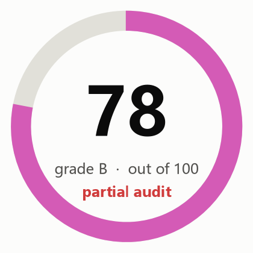

| Area | Score | Weight | How it is scored |
|---|---:|---:|---|
| Crawl and indexing | 81 | 20 | Rules only |
| On-page | 76 | 15 | Rules plus Jev findings |
| Content quality | 57 | 20 | 70% semantic judgment (Laya local model with Jev escalation: helpfulness, specificity, trust), 30% rules |
| Links and architecture | 91 | 10 | Rules only |
| Structured data and sharing | 91 | 8 | Rules plus Jev findings |
| AI search readiness | 71 | 12 | 70% semantic judgment (Laya local model with Jev escalation: citability, answer-first, entity clarity), 30% rules; editorial heuristics, since Google states no special optimization is required for AI features |
| Performance | 93 | 10 | Crawl observations only: PageSpeed Insights unavailable |
| Security and trust | 94 | 5 | Rules only |
| Search visibility and authority | n/a | 15 | Not assessed: run with --full (DataForSEO) |

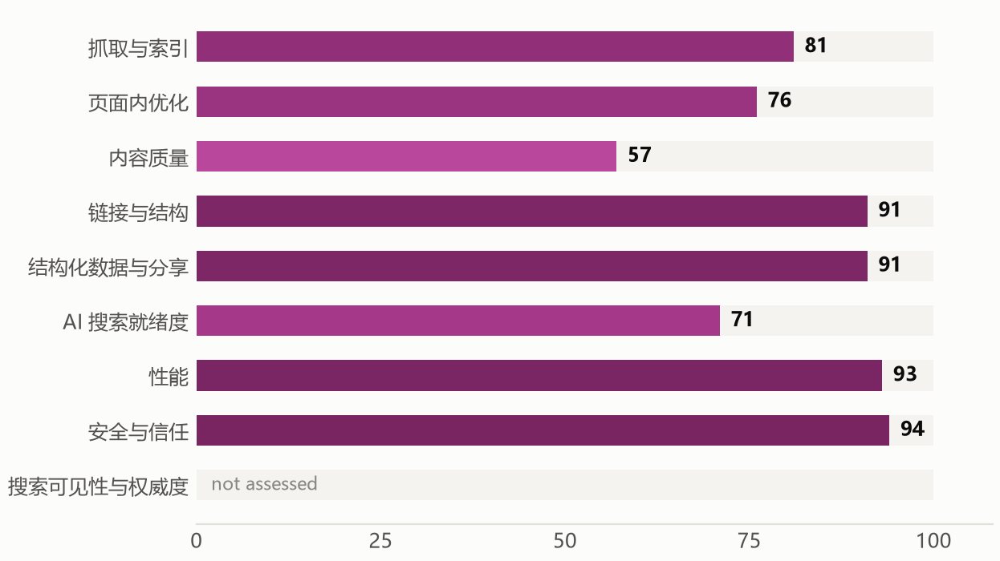

**目录 / Contents:** [Executive summary](#executive-summary) · [How this audit was made](#how-this-audit-was-made) · [Priority actions](#priority-actions) · [What the crawl found](#what-the-crawl-found) · [How the engines read the site](#how-the-engines-read-the-site) · [Findings by area](#findings-by-area) · [Robots access](#robots-access) · [Page inventory](#page-inventory) · [Method and limits](#method-and-limits)

## Executive summary

duckwolf.cn scores 78 out of 100 (grade B) across 8 scored areas. The strongest areas are security and trust, performance, links and architecture; the weakest are content quality, AI search readiness, on-page. The audit produced 30 actions, 4 of them marked fix first and 4 quick wins.

**What is working**

- Security and trust scores 94.
- Performance scores 93.
- Links and architecture scores 91.

**What is holding the site back**

- JEV-001: Homepage does not make the offer clear (Jev value proposition 0.36 (confidence 0.91))
- JEV-002: No mobile viewport meta tag (1 page)
- JEV-003: Internal links pointing to broken URLs (1 broken targets: 403 https://duckwolf.cn/forum.php?mobile=yes (linked from /))
- JEV-004: Canonical target redirects or returns an error (http://duckwolf.cn/aiadplacer.html; http://duckwolf.cn/brandcn.html)

### Plan

**This week**

- JEV-002 No mobile viewport meta tag
- JEV-004 Canonical target redirects or returns an error
- JEV-008 Pages without a meta description
- JEV-011 Pages without an H1 heading

**This month**

- JEV-001 Homepage does not make the offer clear
- JEV-003 Internal links pointing to broken URLs
- JEV-005 Local business without LocalBusiness structured data
- JEV-006 Slow server response (TTFB above 0.8 s)
- JEV-007 Pages Jev would rewrite or consolidate

**This quarter**

- JEV-014 Titles that do not describe the page well
- JEV-015 Few self-contained, quotable facts
- JEV-016 No Strict-Transport-Security header
- JEV-017 Common security headers missing
- JEV-018 No favicon declared

_Written by: Automatic summary (no lead-agent narrative was written)._

## How this audit was made

A source finds, code decides, Jev judges, Claude writes. Code crawls, counts and scores. Jev (TypeSafe's System One model) answers narrow typed questions about meaning, with probabilities. Missing data is shown as missing.

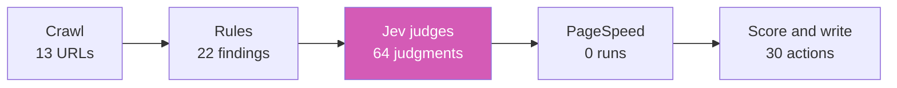

## Priority actions

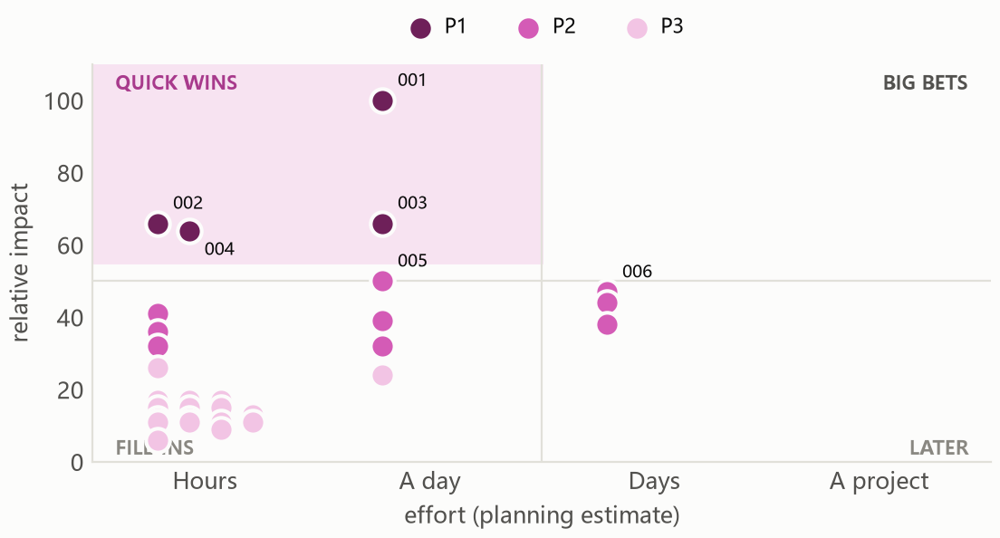

| ID | Action | Priority | Impact | Effort | Pages | By | Verify |
|---|---|---|---:|---|---:|---|---:|
| JEV-001 | Homepage does not make the offer clear | P1 Fix first | 100 | About a day | 1 | Jev judged |  |
| JEV-002 | No mobile viewport meta tag (quick win) | P1 Fix first | 66 | Hours | 1 | rule |  |
| JEV-003 | Internal links pointing to broken URLs | P1 Fix first | 66 | About a day | 1 | rule |  |
| JEV-004 | Canonical target redirects or returns an error (quick win) | P1 Fix first | 64 | Hours | 2 | rule |  |
| JEV-005 | Local business without LocalBusiness structured data | P2 Plan next | 50 | About a day | 1 | Jev judged | 1 |
| JEV-006 | Slow server response (TTFB above 0.8 s) | P2 Plan next | 47 | Several days | 6 | rule |  |
| JEV-007 | Pages Jev would rewrite or consolidate | P2 Plan next | 44 | Several days | 5 | Jev judged | 3 |
| JEV-008 | Pages without a meta description (quick win) | P2 Plan next | 41 | Hours | 4 | rule |  |
| JEV-009 | Key pages show little evidence of expertise or trust | P2 Plan next | 39 | About a day | 3 | Jev judged | 2 |
| JEV-010 | Pages with very little main content | P2 Plan next | 38 | Several days | 3 | rule |  |
| JEV-011 | Pages without an H1 heading (quick win) | P2 Plan next | 36 | Hours | 2 | rule |  |
| JEV-012 | Canonical points to a different URL | P2 Plan next | 32 | Hours | 2 | rule |  |
| JEV-013 | Sitemap lists URLs that redirect, fail or are noindex | P2 Plan next | 32 | About a day | 2 | rule |  |
| JEV-014 | Titles that do not describe the page well | P3 When convenient | 26 | Hours | 2 | Jev judged | 1 |
| JEV-015 | Few self-contained, quotable facts | P3 When convenient | 24 | About a day | 1 | Jev judged | 1 |
| JEV-016 | No Strict-Transport-Security header | P3 When convenient | 17 | Hours | 1 | rule |  |
| JEV-017 | Common security headers missing | P3 When convenient | 17 | Hours | 1 | rule |  |
| JEV-018 | No favicon declared | P3 When convenient | 17 | Hours | 1 | rule |  |
| JEV-019 | Indexable pages missing from the sitemap | P3 When convenient | 15 | Hours | 5 | rule |  |
| JEV-020 | Pages without a canonical link | P3 When convenient | 15 | Hours | 5 | rule |  |
| JEV-021 | Open Graph title or image missing | P3 When convenient | 15 | Hours | 5 | rule |  |
| JEV-022 | Heading levels skipped | P3 When convenient | 13 | Hours | 3 | rule |  |
| JEV-023 | Internal links that go through a redirect | P3 When convenient | 12 | Hours | 2 | rule |  |
| JEV-024 | Structured data missing properties Google requires for rich results | P3 When convenient | 12 | Hours | 2 | rule |  |
| JEV-025 | HTML lang attribute missing | P3 When convenient | 11 | Hours | 1 | rule |  |
| JEV-026 | Images without width and height | P3 When convenient | 11 | Hours | 1 | rule |  |
| JEV-027 | External links returning errors | P3 When convenient | 11 | Hours | 2 | rule |  |
| JEV-028 | Weak meta descriptions | P3 When convenient | 11 | Hours | 1 | Jev judged |  |
| JEV-029 | Pages that bury the main point | P3 When convenient | 9 | Hours | 2 | Jev judged | 1 |
| JEV-030 | Very short or very long titles | P3 When convenient | 6 | Hours | 1 | rule |  |

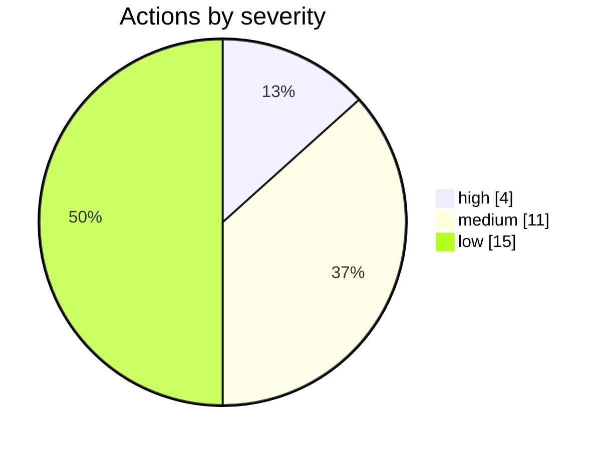

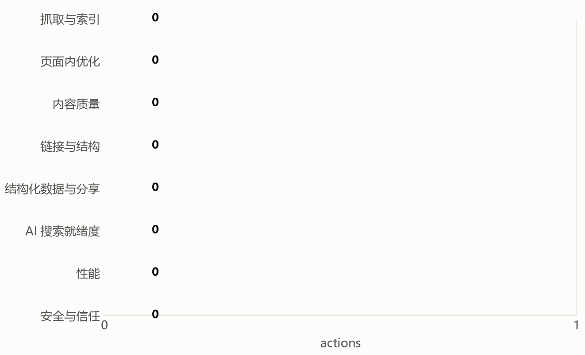

## What the crawl found

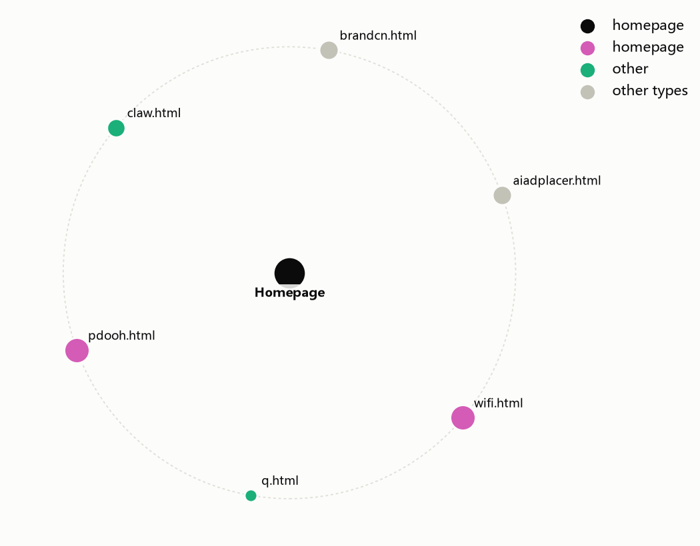

## How the engines read the site

Semantic judgments came from a cascade: **0 pages decided locally by Laya** (a discriminative System One model running on your GPU), **5 pages escalated to Jev** in the cloud. Where a chart or table below says "Jev", read it as *the engine named in the Engine column* of the Semantic judgments sheet.

- **What kind of business is this?** personal or portfolio, confidence 0.88
- **How clear is the offer on the homepage?** 0.36, confidence 0.91
- **Does the homepage say who, what and where?** P(yes) 0.57 _(verify)_
- **How focused is the site's topic set?** 0.42, confidence 0.57 _(verify)_
- **Does it serve a specific local area?** P(yes) 0.56 _(verify)_

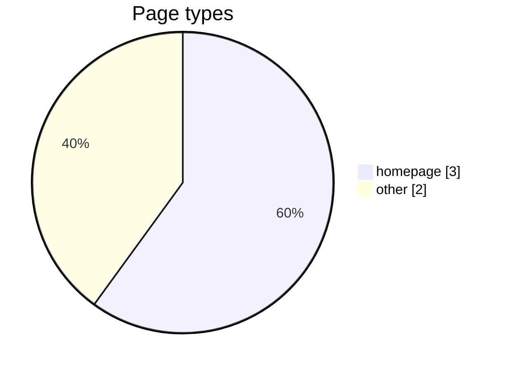

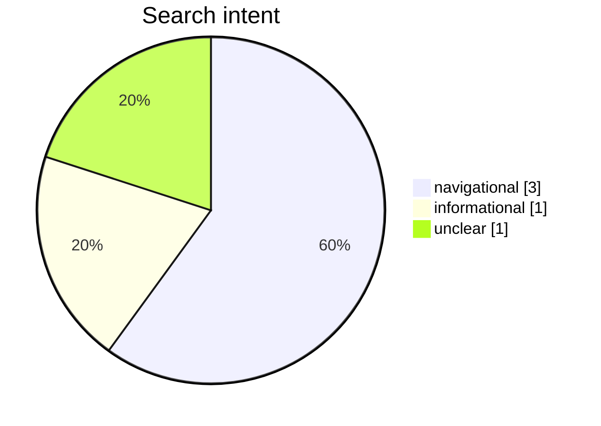

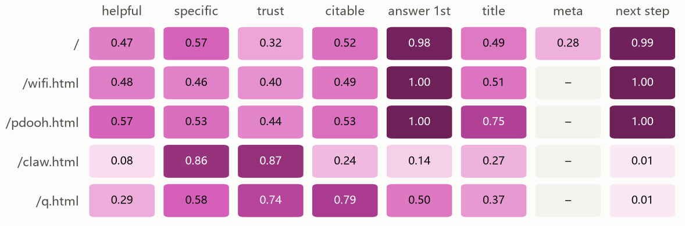

### Where to invest

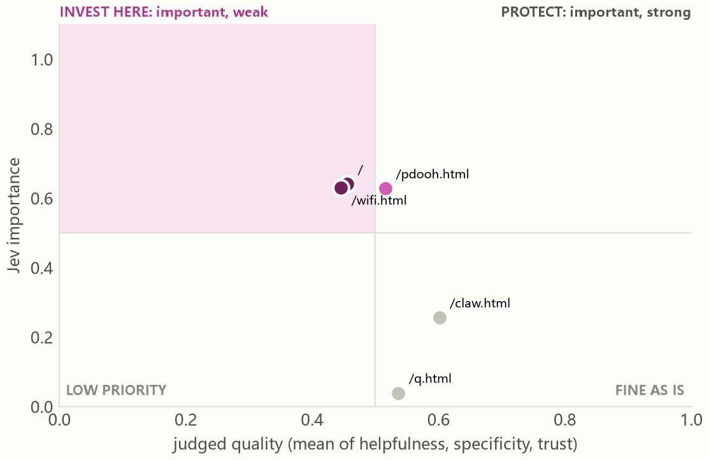

| Important but weak | Importance | Quality | Jev suggests |
|---|---:|---:|---|
| / | 0.64 | 0.46 | rewrite |
| /wifi.html | 0.63 | 0.45 | rewrite |

## Findings by area

### Crawl and indexing (81)

**JEV-004 · Canonical target redirects or returns an error** `P1` `high` `rule`

- Evidence: 2 affected · http://duckwolf.cn/aiadplacer.html; http://duckwolf.cn/brandcn.html
- Fix: Point canonicals at live, indexable URLs. ([source](https://developers.google.com/search/docs/crawling-indexing/consolidate-duplicate-urls))
- URLs: https://duckwolf.cn/aiadplacer.html, https://duckwolf.cn/brandcn.html

**JEV-012 · Canonical points to a different URL** `P2` `medium` `rule`

- Evidence: 2 affected · https://duckwolf.cn/aiadplacer.html -> http://duckwolf.cn/aiadplacer.html; https://duckwolf.cn/brandcn.html -> http://duckwolf.cn/brandcn.html
- Fix: Check that these pages really are duplicates of their canonical target; otherwise self-canonicalise. ([source](https://developers.google.com/search/docs/crawling-indexing/consolidate-duplicate-urls))
- URLs: https://duckwolf.cn/aiadplacer.html, https://duckwolf.cn/brandcn.html

**JEV-013 · Sitemap lists URLs that redirect, fail or are noindex** `P2` `medium` `rule`

- Evidence: 2 affected · 2 of the crawled sitemap URLs are not final indexable pages
- Fix: List only final, indexable, HTTP 200 URLs in the sitemap. ([source](https://developers.google.com/search/docs/crawling-indexing/sitemaps/overview))
- URLs: http://duckwolf.cn/aiadplacer.html, http://duckwolf.cn/brandcn.html

**JEV-019 · Indexable pages missing from the sitemap** `P3` `low` `rule`

- Evidence: 5 affected · 5 crawled indexable pages are not listed
- Fix: Add these canonical pages to the sitemap. ([source](https://developers.google.com/search/docs/crawling-indexing/sitemaps/overview))
- URLs: https://duckwolf.cn/, https://duckwolf.cn/q.html, https://duckwolf.cn/claw.html, https://duckwolf.cn/pdooh.html, https://duckwolf.cn/wifi.html

**JEV-020 · Pages without a canonical link** `P3` `low` `rule`

- Evidence: 5 affected · 5 of 7 pages
- Fix: Add a self-referencing rel=canonical to each indexable page. ([source](https://developers.google.com/search/docs/crawling-indexing/consolidate-duplicate-urls))
- URLs: https://duckwolf.cn/, https://duckwolf.cn/q.html, https://duckwolf.cn/claw.html, https://duckwolf.cn/pdooh.html, https://duckwolf.cn/wifi.html

### On-page (76)

**JEV-002 · No mobile viewport meta tag** `P1` `high` `rule`

- Evidence: 1 affected · 1 page
- Fix: Add a responsive viewport meta tag. ([source](https://developers.google.com/search/docs/crawling-indexing/mobile/mobile-sites-mobile-first-indexing))
- URLs: https://duckwolf.cn/

**JEV-008 · Pages without a meta description** `P2` `medium` `rule`

- Evidence: 4 affected · 4 indexable pages
- Fix: Write a page-specific summary. Google may still generate its own snippet. ([source](https://developers.google.com/search/docs/appearance/snippet))
- URLs: https://duckwolf.cn/q.html, https://duckwolf.cn/claw.html, https://duckwolf.cn/pdooh.html, https://duckwolf.cn/wifi.html

**JEV-011 · Pages without an H1 heading** `P2` `medium` `rule` `heuristic`

- Evidence: 2 affected · 2 indexable pages
- Fix: Give each page one visible main heading that states its topic. ([source](https://developers.google.com/search/docs/fundamentals/seo-starter-guide))
- URLs: https://duckwolf.cn/, https://duckwolf.cn/claw.html

**JEV-014 · Titles that do not describe the page well** `P3` `medium` `Jev judged` `1 to verify`

- Evidence: 2 affected · Jev title fit averaged 0.32 (0 worst, 1 best) on 2 pages: /q.html, /claw.html
- Fix: Rewrite these titles to name what the page offers in the searcher's words. ([source](https://developers.google.com/search/docs/appearance/title-link))
- URLs: https://duckwolf.cn/q.html, https://duckwolf.cn/claw.html

**JEV-022 · Heading levels skipped** `P3` `low` `rule` `heuristic`

- Evidence: 3 affected · 3 pages skip a heading level
- Fix: Nest headings in order (H2 under H1, H3 under H2). ([source](https://developers.google.com/search/docs/fundamentals/seo-starter-guide))
- URLs: https://duckwolf.cn/, https://duckwolf.cn/pdooh.html, https://duckwolf.cn/wifi.html

**JEV-025 · HTML lang attribute missing** `P3` `low` `rule`

- Evidence: 1 affected · 1 page
- Fix: Declare the page language on the html element. ([source](https://developer.mozilla.org/en-US/docs/Web/HTML/Reference/Global_attributes/lang))
- URLs: https://duckwolf.cn/

**JEV-028 · Weak meta descriptions** `P3` `low` `Jev judged`

- Evidence: 1 affected · Jev meta description fit averaged 0.28 (0 worst, 1 best) on 1 page: /
- Fix: Rewrite these descriptions as a specific summary of what the page delivers. ([source](https://developers.google.com/search/docs/appearance/snippet))
- URLs: https://duckwolf.cn/

**JEV-030 · Very short or very long titles** `P3` `low` `rule` `heuristic`

- Evidence: 1 affected · 4 chars
- Fix: Aim for a concise, descriptive title. Google truncates by pixel width, so there is no fixed limit; 15 to 65 characters is a display convention. ([source](https://developers.google.com/search/docs/appearance/title-link))
- URLs: https://duckwolf.cn/q.html

### Content quality (57)

**JEV-001 · Homepage does not make the offer clear** `P1` `high` `Jev judged`

- Evidence: 1 affected · Jev value proposition 0.36 (confidence 0.91)
- Fix: State what you offer, for whom, and why choose you in the first screen of the homepage. ([source](https://developers.google.com/search/docs/fundamentals/creating-helpful-content))
- URLs: https://duckwolf.cn/

**JEV-007 · Pages Jev would rewrite or consolidate** `P2` `medium` `Jev judged` `3 to verify` `heuristic`

- Evidence: 5 affected · 5 pages: / (rewrite); /q.html (merge or remove); /claw.html (merge or remove); /pdooh.html (rewrite); /wifi.html (rewrite)
- Fix: Review each page against the suggested action. This is Jev's editorial judgment, not a search engine rule. ([source](https://developers.google.com/search/docs/fundamentals/creating-helpful-content))
- URLs: https://duckwolf.cn/, https://duckwolf.cn/q.html, https://duckwolf.cn/claw.html, https://duckwolf.cn/pdooh.html, https://duckwolf.cn/wifi.html

**JEV-009 · Key pages show little evidence of expertise or trust** `P2` `medium` `Jev judged` `2 to verify`

- Evidence: 3 affected · Jev trust averaged 0.39 (0 worst, 1 best) on 3 pages: /, /pdooh.html, /wifi.html
- Fix: Add named people, credentials, reviews, sources, results and contact details where they help the reader. ([source](https://developers.google.com/search/docs/fundamentals/creating-helpful-content))
- URLs: https://duckwolf.cn/, https://duckwolf.cn/pdooh.html, https://duckwolf.cn/wifi.html

**JEV-010 · Pages with very little main content** `P2` `medium` `rule` `heuristic`

- Evidence: 3 affected · /q.html: 30 words; /claw.html: 19 words; /wifi.html: 134 words
- Fix: Expand pages that should rank with substance a visitor needs, or consolidate them. Word count is a warning sign, not a ranking factor. ([source](https://developers.google.com/search/docs/fundamentals/creating-helpful-content))
- URLs: https://duckwolf.cn/q.html, https://duckwolf.cn/claw.html, https://duckwolf.cn/wifi.html

### Links and architecture (91)

**JEV-003 · Internal links pointing to broken URLs** `P1` `high` `rule`

- Evidence: 1 affected · 1 broken targets: 403 https://duckwolf.cn/forum.php?mobile=yes (linked from /)
- Fix: Update or remove links that point to 4xx, 5xx or unreachable URLs. ([source](https://developers.google.com/crawling/docs/troubleshooting/http-status-codes))
- URLs: https://duckwolf.cn/

**JEV-023 · Internal links that go through a redirect** `P3` `low` `rule`

- Evidence: 2 affected · / links to /aiadplacer.html (redirects to /aiadplacer.html); / links to /brandcn.html (redirects to /brandcn.html); / links to /claw.html (redirects to /claw.html); / links to /pdooh.html (redirects to /pdooh.html); / links to /q.html (redirects to /q.html); and 2 more
- Fix: Link directly to the final URL. ([source](https://developers.google.com/search/docs/crawling-indexing/301-redirects))
- URLs: https://duckwolf.cn/, https://duckwolf.cn/aiadplacer.html

**JEV-027 · External links returning errors** `P3` `low` `rule`

- Evidence: 2 affected · 2 of 15 sampled outbound links
- Fix: Update or remove outbound links that no longer resolve. ([source](https://developers.google.com/crawling/docs/troubleshooting/http-status-codes))
- URLs: https://moltlist.onrender.com/, https://wpa.qq.com/msgrd?v=3&uin=602947&site=duckwolf.cn&menu=yes&from=discuz

### Structured data and sharing (91)

**JEV-005 · Local business without LocalBusiness structured data** `P2` `medium` `Jev judged` `1 to verify`

- Evidence: 1 affected · Serves a local area P(yes) 0.56; homepage schema: offer organization person postaladdress propertyvalue softwareapplication webpage website
- Fix: Add LocalBusiness JSON-LD with name, address, phone and opening hours that match the page. ([source](https://developers.google.com/search/docs/appearance/structured-data/intro-structured-data))
- URLs: https://duckwolf.cn/

**JEV-021 · Open Graph title or image missing** `P3` `low` `rule`

- Evidence: 5 affected · 5 pages lack og:title or og:image
- Fix: Add og:title, og:description and og:image for link previews. ([source](https://ogp.me/))
- URLs: https://duckwolf.cn/, https://duckwolf.cn/q.html, https://duckwolf.cn/claw.html, https://duckwolf.cn/pdooh.html, https://duckwolf.cn/wifi.html

**JEV-024 · Structured data missing properties Google requires for rich results** `P3` `low` `rule`

- Evidence: 2 affected · SoftwareApplication on / lacks aggregateRating or review; SoftwareApplication on /aiadplacer.html lacks aggregateRating or review
- Fix: Add the missing required properties listed in the evidence, or remove markup that cannot be completed truthfully. ([source](https://developers.google.com/search/docs/appearance/structured-data/intro-structured-data))
- URLs: https://duckwolf.cn/, https://duckwolf.cn/aiadplacer.html

### AI search readiness (71)

**JEV-015 · Few self-contained, quotable facts** `P3` `medium` `Jev judged` `1 to verify` `heuristic`

- Evidence: 1 affected · Jev citability averaged 0.24 (0 worst, 1 best) on 1 page: /claw.html
- Fix: Add clear statements of fact, definitions and figures that make sense on their own. Editorial heuristic, not a Google requirement. ([source](https://developers.google.com/search/docs/appearance/ai-features))
- URLs: https://duckwolf.cn/claw.html

**JEV-029 · Pages that bury the main point** `P3` `low` `Jev judged` `1 to verify` `heuristic`

- Evidence: 2 affected · Jev P(opens with the point) averaged 0.32 (0 worst, 1 best) on 2 pages: /q.html, /claw.html
- Fix: Open with a one or two sentence answer or offer before any preamble. Editorial heuristic for readers and answer engines, not a Google requirement. ([source](https://developers.google.com/search/docs/appearance/ai-features))
- URLs: https://duckwolf.cn/q.html, https://duckwolf.cn/claw.html

### Performance (93)

**JEV-006 · Slow server response (TTFB above 0.8 s)** `P2` `medium` `rule`

- Evidence: 6 affected · /: 2045 ms; /claw.html: 2758 ms; /pdooh.html: 2806 ms; /wifi.html: 1299 ms; /aiadplacer.html: 2584 ms; /brandcn.html: 1146 ms
- Fix: Cache pages, use a CDN and reduce server work before the first byte. ([source](https://web.dev/articles/ttfb))
- URLs: https://duckwolf.cn/, https://duckwolf.cn/claw.html, https://duckwolf.cn/pdooh.html, https://duckwolf.cn/wifi.html, https://duckwolf.cn/aiadplacer.html, https://duckwolf.cn/brandcn.html

**JEV-026 · Images without width and height** `P3` `low` `rule`

- Evidence: 1 affected · 10 images without explicit size
- Fix: Set width and height so layout does not shift while images load. ([source](https://web.dev/articles/optimize-cls))
- URLs: https://duckwolf.cn/

### Security and trust (94)

**JEV-016 · No Strict-Transport-Security header** `P3` `low` `rule`

- Evidence: 1 affected · Homepage response has no HSTS header
- Fix: Send an HSTS header once HTTPS is stable everywhere. ([source](https://developer.mozilla.org/en-US/docs/Web/HTTP/Reference/Headers/Strict-Transport-Security))
- URLs: https://duckwolf.cn/

**JEV-017 · Common security headers missing** `P3` `low` `rule`

- Evidence: 1 affected · Missing on the homepage response: x-content-type-options, referrer-policy, x-frame-options or CSP frame-ancestors
- Fix: Add the missing headers: x-content-type-options, referrer-policy, x-frame-options or CSP frame-ancestors. ([source](https://owasp.org/projects/secure-headers-project))
- URLs: https://duckwolf.cn/

**JEV-018 · No favicon declared** `P3` `low` `rule`

- Evidence: 1 affected · No link rel=icon on the homepage
- Fix: Declare a favicon; Google shows it beside results. ([source](https://developers.google.com/search/docs/fundamentals/seo-starter-guide))
- URLs: https://duckwolf.cn/

## Robots access

| User agent | Access |
|---|---|
| Googlebot | allowed |
| Bingbot | allowed |
| GPTBot | allowed |
| OAI-SearchBot | allowed |
| ChatGPT-User | allowed |
| ClaudeBot | allowed |
| Claude-SearchBot | allowed |
| PerplexityBot | allowed |
| Google-Extended | allowed |
| Applebot-Extended | allowed |
| CCBot | allowed |
| Bytespider | allowed |

## Page inventory

| Page | Depth | Words | Inlinks | Type (Jev) | Intent (Jev) | Importance | Action (Jev) |
|---|---:|---:|---:|---|---|---:|---|
| https://duckwolf.cn/ | 0 | 275 | 0 | homepage | navigational | 0.64 | rewrite |
| https://duckwolf.cn/aiadplacer.html | 1 | 219 | 2 |  |  |  |  |
| https://duckwolf.cn/brandcn.html | 1 | 187 | 1 |  |  |  |  |
| https://duckwolf.cn/claw.html | 1 | 19 | 1 | other | unclear | 0.26 | merge or remove |
| https://duckwolf.cn/pdooh.html | 1 | 610 | 1 | homepage | navigational | 0.63 | rewrite |
| https://duckwolf.cn/q.html | 1 | 30 | 1 | other | informational | 0.04 | merge or remove |
| https://duckwolf.cn/wifi.html | 1 | 134 | 1 | homepage | navigational | 0.63 | rewrite |

## Method and limits

- Area score: 100 minus, per finding, severity amount (critical 25, high 12, medium 6, low 2) × (0.5 + 0.5 × share of pages affected). Content and AI readiness blend 70% semantic judgment with 30% rules. Performance blends 50% Lighthouse mobile with 50% crawl observations.
- Overall: weighted mean of scored areas; unscored areas are excluded, never zero.
- Impact: severity weight × (0.6 + 0.4 × reach) × (0.6 + 0.8 × highest semantic importance of affected pages), scaled to 100.
- Engine answers are decisive at confidence 0.80 (Choice, Score) or P(yes) at least 0.80 or at most 0.20 (Noul). Others are flagged to verify.
- Engines: Laya decided 0 pages locally (~0 ms per call on GPU); Jev answered 5 pages in the cloud (15 requests, 128511 input tokens, 4 failed, $0.0000).
- No Search Console, analytics, backlink or keyword data was used (run with --full for DataForSEO).
- Scores rank work; they do not predict rankings or traffic.

_Generated by laya-seo 0.1.1._
