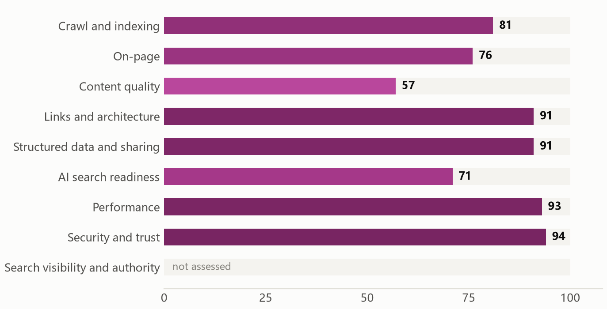
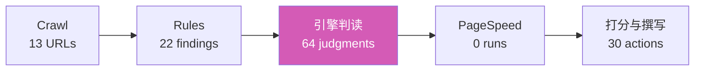
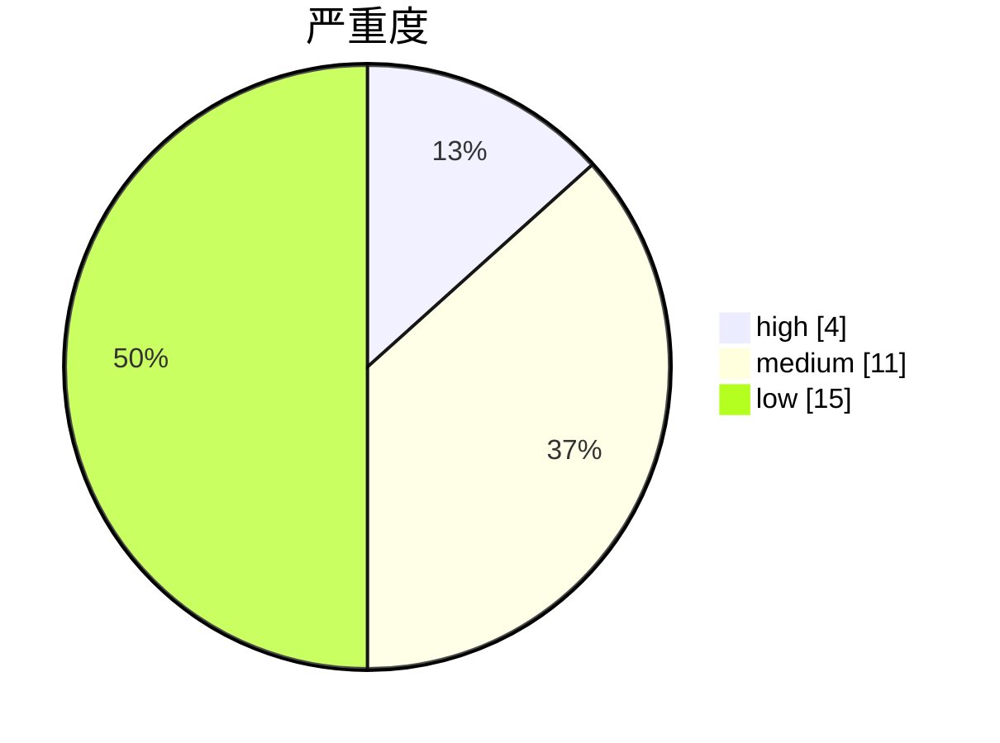
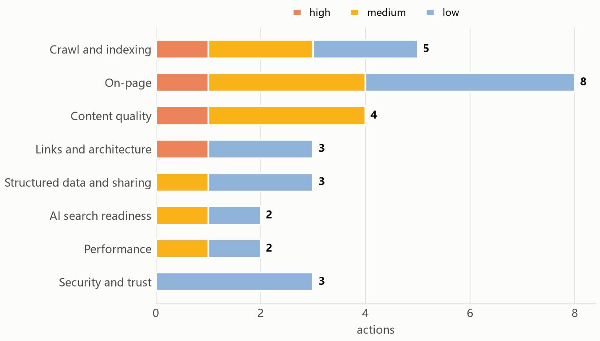
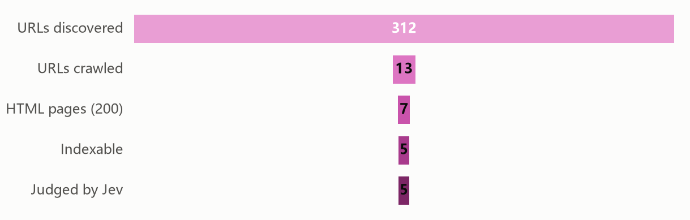
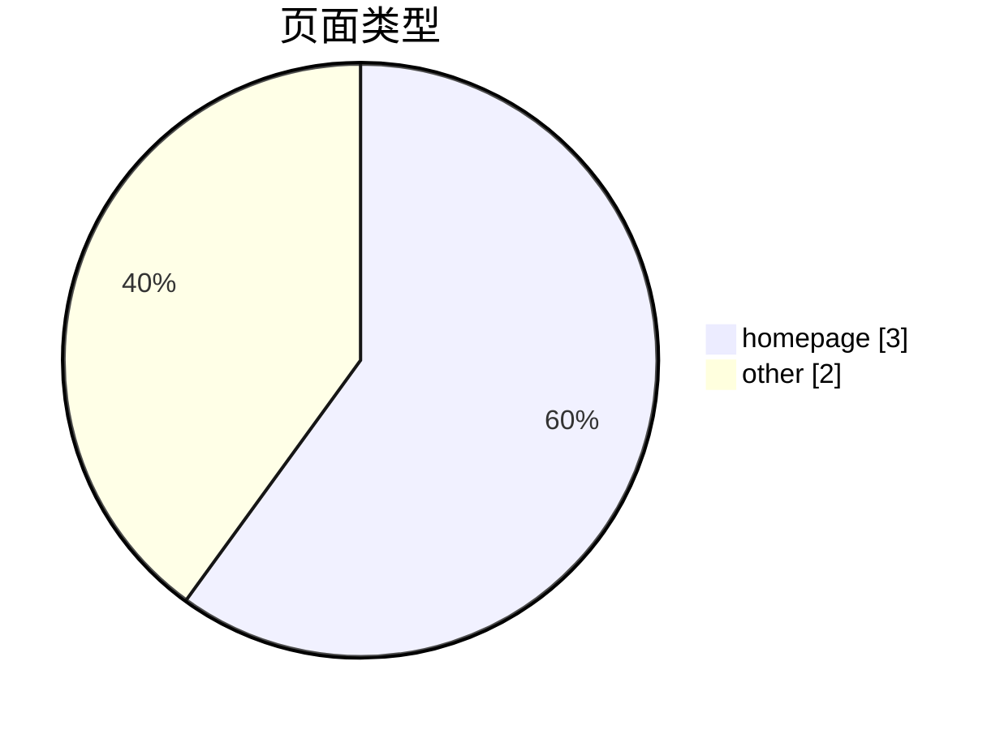
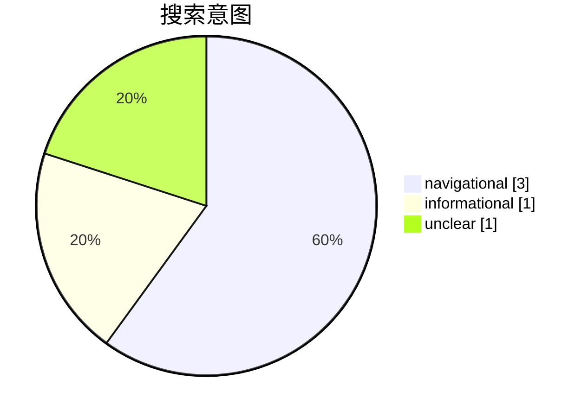
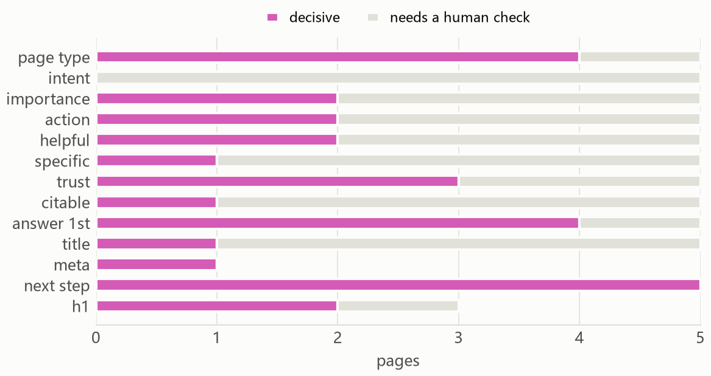

# Laya SEO 审计报告: duckwolf.cn

审计时间 2026-10-04T16:08:23+00:00 · 13 已抓取 URL · 7 HTML 页面 · 64 条语义判断 · 0 页由本地 Laya 判定，5 页由 Jev 判定 · 引擎费用 $0.0054

**总分: 78/100 (等级 B)**

> **部分审计:** PageSpeed Insights 不可用，性能仅用抓取计时估算. 总分仅覆盖已评估的区域。

| 区域 | 得分 | 权重 | 评分方式 |
|---|---:|---:|---|
| 抓取与索引 | 81 | 20 | 仅规则 |
| 页面内优化 | 76 | 15 | 规则 + 引擎判断 |
| 内容质量 | 57 | 20 | 70% 语义判断（有用性、具体性、可信度），30% 规则 |
| 链接与结构 | 91 | 10 | 仅规则 |
| 结构化数据与分享 | 91 | 8 | 仅规则 |
| AI 搜索就绪度 | 71 | 12 | 70% 语义判断（可引用性、开头给结论、主体清晰度），30% 规则；属编辑经验，Google 明确表示其 AI 功能无需特殊优化 |
| 性能 | 93 | 10 | 50% Lighthouse 移动端 + 50% 抓取观测 |
| 安全与信任 | 94 | 5 | 仅规则 |
| 搜索可见性与权威度 | 未评估 | 15 | 未评估：加 --full 启用 DataForSEO |

**目录 / Contents:** [执行摘要](#执行摘要) · [审计方法](#审计方法) · [优先行动](#优先行动) · [抓取发现](#抓取发现) · [各引擎如何判读本站](#各引擎如何判读本站) · [各区域发现](#各区域发现) · [Robots 与访问](#robots-与访问) · [页面清单](#页面清单) · [方法与局限](#方法与局限)

## 执行摘要

duckwolf.cn 在 8 个已评分区域中拿到 78 分（等级 B）。最强的是安全与信任、性能、链接与结构；最弱的是内容质量、AI 搜索就绪度、页面内优化。本次审计共产出 30 个行动项，其中 4 个标记为优先修，4 个为快速见效项。

**最强**

- 安全与信任 得分 94。
- 性能 得分 93。
- 链接与结构 得分 91。

**最弱**

- JEV-001：首页没有清楚说明所提供的产品〔证据〕Jev value proposition 0.36 (confidence 0.91)
- JEV-002：没有移动端 viewport meta 标签〔证据〕1 page
- JEV-003：内部链接指向无法访问的地址〔证据〕1 broken targets: 403 https://duckwolf.cn/forum.php?mobile=yes (linked from /)
- JEV-004：canonical 目标发生跳转或返回错误〔证据〕http://duckwolf.cn/aiadplacer.html; http://duckwolf.cn/brandcn.html

### 方法

**本周**

- JEV-002 没有移动端 viewport meta 标签
- JEV-004 canonical 目标发生跳转或返回错误
- JEV-008 页面没有 meta description
- JEV-011 页面没有 H1 主标题

**本月**

- JEV-001 首页没有清楚说明所提供的产品
- JEV-003 内部链接指向无法访问的地址
- JEV-005 本地业务但缺少 LocalBusiness 结构化数据
- JEV-006 服务端响应偏慢（TTFB 超过 0.8 秒）
- JEV-007 建议重写或合并的页面

**本季度**

- JEV-014 标题没有准确描述页面内容
- JEV-015 缺少可独立引用的完整事实
- JEV-016 没有 Strict-Transport-Security 响应头
- JEV-017 缺少常见安全响应头
- JEV-018 没有声明 favicon

_撰写: 自动摘要（未撰写人工叙述）._

## 审计方法

源码负责发现，代码负责计算，引擎负责判读，助手负责撰写。代码负责抓取、计数与打分；语义引擎对「含义」回答有类型的窄问题，并保留概率。缺失的数据就显示为缺失。

## 优先行动

| ID | 行动项 | 优先级 | 影响 | 成本 | Pages | 检查项 | 需人工复核 |
|---|---|---|---:|---|---:|---|---:|
| JEV-001 | 首页没有清楚说明所提供的产品 | P1 P1 最优先 | 100 | 小 | 1 | 引擎判定 |  |
| JEV-002 | 没有移动端 viewport meta 标签（快速见效） | P1 P1 最优先 | 66 | 很小 | 1 | 规则检查 |  |
| JEV-003 | 内部链接指向无法访问的地址 | P1 P1 最优先 | 66 | 小 | 1 | 规则检查 |  |
| JEV-004 | canonical 目标发生跳转或返回错误（快速见效） | P1 P1 最优先 | 64 | 很小 | 2 | 规则检查 |  |
| JEV-005 | 本地业务但缺少 LocalBusiness 结构化数据 | P2 P2 重要 | 50 | 小 | 1 | 引擎判定 | 1 |
| JEV-006 | 服务端响应偏慢（TTFB 超过 0.8 秒） | P2 P2 重要 | 47 | 中 | 6 | 规则检查 |  |
| JEV-007 | 建议重写或合并的页面 | P2 P2 重要 | 44 | 中 | 5 | 引擎判定 | 3 |
| JEV-008 | 页面没有 meta description（快速见效） | P2 P2 重要 | 41 | 很小 | 4 | 规则检查 |  |
| JEV-009 | 关键页面缺少专业度与可信度证据 | P2 P2 重要 | 39 | 小 | 3 | 引擎判定 | 2 |
| JEV-010 | 页面正文内容过少 | P2 P2 重要 | 38 | 中 | 3 | 规则检查 |  |
| JEV-011 | 页面没有 H1 主标题（快速见效） | P2 P2 重要 | 36 | 很小 | 2 | 规则检查 |  |
| JEV-012 | canonical 指向其他 URL | P2 P2 重要 | 32 | 很小 | 2 | 规则检查 |  |
| JEV-013 | 站点地图中列出的 URL 存在跳转、错误或 noindex | P2 P2 重要 | 32 | 小 | 2 | 规则检查 |  |
| JEV-014 | 标题没有准确描述页面内容 | P3 P3 可做 | 26 | 很小 | 2 | 引擎判定 | 1 |
| JEV-015 | 缺少可独立引用的完整事实 | P3 P3 可做 | 24 | 小 | 1 | 引擎判定 | 1 |
| JEV-016 | 没有 Strict-Transport-Security 响应头 | P3 P3 可做 | 17 | 很小 | 1 | 规则检查 |  |
| JEV-017 | 缺少常见安全响应头 | P3 P3 可做 | 17 | 很小 | 1 | 规则检查 |  |
| JEV-018 | 没有声明 favicon | P3 P3 可做 | 17 | 很小 | 1 | 规则检查 |  |
| JEV-019 | 可索引页面未出现在站点地图中 | P3 P3 可做 | 15 | 很小 | 5 | 规则检查 |  |
| JEV-020 | 页面没有 canonical 标签 | P3 P3 可做 | 15 | 很小 | 5 | 规则检查 |  |
| JEV-021 | Open Graph 标题或图片缺失 | P3 P3 可做 | 15 | 很小 | 5 | 规则检查 |  |
| JEV-022 | 标题层级跳级 | P3 P3 可做 | 13 | 很小 | 3 | 规则检查 |  |
| JEV-023 | 内部链接经过重定向才到达目标 | P3 P3 可做 | 12 | 很小 | 2 | 规则检查 |  |
| JEV-024 | 结构化数据缺少 Google 富媒体结果所需字段 | P3 P3 可做 | 12 | 很小 | 2 | 规则检查 |  |
| JEV-025 | 页面没有声明语言 | P3 P3 可做 | 11 | 很小 | 1 | 规则检查 |  |
| JEV-026 | 图片未声明宽高 | P3 P3 可做 | 11 | 很小 | 1 | 规则检查 |  |
| JEV-027 | 外部链接返回错误 | P3 P3 可做 | 11 | 很小 | 2 | 规则检查 |  |
| JEV-028 | meta description 质量偏弱 | P3 P3 可做 | 11 | 很小 | 1 | 引擎判定 |  |
| JEV-029 | 页面把重点埋在后面 | P3 P3 可做 | 9 | 很小 | 2 | 引擎判定 | 1 |
| JEV-030 | 标题过短或过长 | P3 P3 可做 | 6 | 很小 | 1 | 规则检查 |  |

## 抓取发现

## 各引擎如何判读本站

语义判断来自级联：**0 页由本地 Laya 判定**（运行在本机 GPU 上的判别式 System One 模型），**5 页升级到云端 Jev**。下方图表或表格中标「Jev」的地方，请读作「Semantic judgments 工作表 Engine 列所指的引擎」。

- **What kind of business is this?** personal or portfolio，置信度 0.88
- **How clear is the offer on the homepage?** 0.36，置信度 0.91
- **Does the homepage say who, what and where?** P(yes) 0.57 （需复核）
- **How focused is the site's topic set?** 0.42，置信度 0.57 （需复核）
- **Does it serve a specific local area?** P(yes) 0.56 （需复核）

### 投入方向

| Important but weak | 重要度 | 质量 | 引擎建议 |
|---|---:|---:|---|
| / | 0.64 | 0.46 | rewrite |
| /wifi.html | 0.63 | 0.45 | rewrite |

## 各区域发现

### 抓取与索引 (81)

**JEV-004 · canonical 目标发生跳转或返回错误** `P1` `高` `规则检查`

- 证据: 2 受影响 · http://duckwolf.cn/aiadplacer.html; http://duckwolf.cn/brandcn.html
- 修法: 把 canonical 改为最终可访问的规范地址。注意：若站点用 http 的 canonical 而实际服务是 https，canonical 自身会跳转，等于告诉搜索引擎「规范版本不存在」。 ([依据](https://developers.google.com/search/docs/crawling-indexing/consolidate-duplicate-urls))
- 涉及 URL: https://duckwolf.cn/aiadplacer.html, https://duckwolf.cn/brandcn.html

**JEV-012 · canonical 指向其他 URL** `P2` `中` `规则检查`

- 证据: 2 受影响 · https://duckwolf.cn/aiadplacer.html -> http://duckwolf.cn/aiadplacer.html; https://duckwolf.cn/brandcn.html -> http://duckwolf.cn/brandcn.html
- 修法: 确认是否有意合并页面；若非有意，把 canonical 改为自身。 ([依据](https://developers.google.com/search/docs/crawling-indexing/consolidate-duplicate-urls))
- 涉及 URL: https://duckwolf.cn/aiadplacer.html, https://duckwolf.cn/brandcn.html

**JEV-013 · 站点地图中列出的 URL 存在跳转、错误或 noindex** `P2` `中` `规则检查`

- 证据: 2 受影响 · 2 of the crawled sitemap URLs are not final indexable pages
- 修法: 站点地图中只保留最终、可索引、返回 HTTP 200 的 URL。 ([依据](https://developers.google.com/search/docs/crawling-indexing/sitemaps/overview))
- 涉及 URL: http://duckwolf.cn/aiadplacer.html, http://duckwolf.cn/brandcn.html

**JEV-019 · 可索引页面未出现在站点地图中** `P3` `低` `规则检查`

- 证据: 5 受影响 · 5 crawled indexable pages are not listed
- 修法: 把这些规范页面补进站点地图。 ([依据](https://developers.google.com/search/docs/crawling-indexing/sitemaps/overview))
- 涉及 URL: https://duckwolf.cn/, https://duckwolf.cn/q.html, https://duckwolf.cn/claw.html, https://duckwolf.cn/pdooh.html, https://duckwolf.cn/wifi.html

**JEV-020 · 页面没有 canonical 标签** `P3` `低` `规则检查`

- 证据: 5 受影响 · 5 of 7 pages
- 修法: 为可索引页面加上指向自身的 canonical。 ([依据](https://developers.google.com/search/docs/crawling-indexing/consolidate-duplicate-urls))
- 涉及 URL: https://duckwolf.cn/, https://duckwolf.cn/q.html, https://duckwolf.cn/claw.html, https://duckwolf.cn/pdooh.html, https://duckwolf.cn/wifi.html

### 页面内优化 (76)

**JEV-002 · 没有移动端 viewport meta 标签** `P1` `高` `规则检查`

- 证据: 1 受影响 · 1 page
- 修法: 添加 &lt;meta name=viewport content="width=device-width, initial-scale=1.0"&gt;。这是移动端排版正常的前提，也是移动优先索引的基线要求。 ([依据](https://developers.google.com/search/docs/crawling-indexing/mobile/mobile-sites-mobile-first-indexing))
- 涉及 URL: https://duckwolf.cn/

**JEV-008 · 页面没有 meta description** `P2` `中` `规则检查`

- 证据: 4 受影响 · 4 indexable pages
- 修法: 为每个可索引页面写一段能准确概括内容的描述。 ([依据](https://developers.google.com/search/docs/appearance/snippet))
- 涉及 URL: https://duckwolf.cn/q.html, https://duckwolf.cn/claw.html, https://duckwolf.cn/pdooh.html, https://duckwolf.cn/wifi.html

**JEV-011 · 页面没有 H1 主标题** `P2` `中` `规则检查` `编辑经验（非搜索引擎规则）`

- 证据: 2 受影响 · 2 indexable pages
- 修法: 为每个页面加一个说明主题的 H1。 ([依据](https://developers.google.com/search/docs/fundamentals/seo-starter-guide))
- 涉及 URL: https://duckwolf.cn/, https://duckwolf.cn/claw.html

**JEV-014 · 标题没有准确描述页面内容** `P3` `中` `引擎判定` `1 项待复核`

- 证据: 2 受影响 · Jev title fit averaged 0.32 (0 worst, 1 best) on 2 pages: /q.html, /claw.html
- 修法: 用搜索者的表达方式重写标题，说清页面提供什么。 ([依据](https://developers.google.com/search/docs/appearance/title-link))
- 涉及 URL: https://duckwolf.cn/q.html, https://duckwolf.cn/claw.html

**JEV-022 · 标题层级跳级** `P3` `低` `规则检查` `编辑经验（非搜索引擎规则）`

- 证据: 3 受影响 · 3 pages skip a heading level
- 修法: 例如从 H2 直接跳到 H4。按顺序使用标题层级，有助于无障碍阅读与结构解析。 ([依据](https://developers.google.com/search/docs/fundamentals/seo-starter-guide))
- 涉及 URL: https://duckwolf.cn/, https://duckwolf.cn/pdooh.html, https://duckwolf.cn/wifi.html

**JEV-025 · 页面没有声明语言** `P3` `低` `规则检查`

- 证据: 1 受影响 · 1 page
- 修法: 在 html 标签上设置 lang 属性。 ([依据](https://developer.mozilla.org/en-US/docs/Web/HTML/Reference/Global_attributes/lang))
- 涉及 URL: https://duckwolf.cn/

**JEV-028 · meta description 质量偏弱** `P3` `低` `引擎判定`

- 证据: 1 受影响 · Jev meta description fit averaged 0.28 (0 worst, 1 best) on 1 page: /
- 修法: 把描述改为具体概括页面交付内容。 ([依据](https://developers.google.com/search/docs/appearance/snippet))
- 涉及 URL: https://duckwolf.cn/

**JEV-030 · 标题过短或过长** `P3` `低` `规则检查` `编辑经验（非搜索引擎规则）`

- 证据: 1 受影响 · 4 chars
- 修法: 把标题调整到能准确概括页面主题的长度。 ([依据](https://developers.google.com/search/docs/appearance/title-link))
- 涉及 URL: https://duckwolf.cn/q.html

### 内容质量 (57)

**JEV-001 · 首页没有清楚说明所提供的产品** `P1` `高` `引擎判定`

- 证据: 1 受影响 · Jev value proposition 0.36 (confidence 0.91)
- 修法: 在首页首屏写清楚：你提供什么、面向谁、为什么选你。 ([依据](https://developers.google.com/search/docs/fundamentals/creating-helpful-content))
- 涉及 URL: https://duckwolf.cn/

**JEV-007 · 建议重写或合并的页面** `P2` `中` `引擎判定` `3 项待复核` `编辑经验（非搜索引擎规则）`

- 证据: 5 受影响 · 5 pages: / (rewrite); /q.html (merge or remove); /claw.html (merge or remove); /pdooh.html (rewrite); /wifi.html (rewrite)
- 修法: 逐页对照建议动作处理。这是引擎的编辑判断，不是搜索引擎规则。 ([依据](https://developers.google.com/search/docs/fundamentals/creating-helpful-content))
- 涉及 URL: https://duckwolf.cn/, https://duckwolf.cn/q.html, https://duckwolf.cn/claw.html, https://duckwolf.cn/pdooh.html, https://duckwolf.cn/wifi.html

**JEV-009 · 关键页面缺少专业度与可信度证据** `P2` `中` `引擎判定` `2 项待复核`

- 证据: 3 受影响 · Jev trust averaged 0.39 (0 worst, 1 best) on 3 pages: /, /pdooh.html, /wifi.html
- 修法: 在有助于读者理解处补充具名人员、资质、评价、来源、成果与联系方式。 ([依据](https://developers.google.com/search/docs/fundamentals/creating-helpful-content))
- 涉及 URL: https://duckwolf.cn/, https://duckwolf.cn/pdooh.html, https://duckwolf.cn/wifi.html

**JEV-010 · 页面正文内容过少** `P2` `中` `规则检查` `编辑经验（非搜索引擎规则）`

- 证据: 3 受影响 · /q.html: 30 words; /claw.html: 19 words; /wifi.html: 134 words
- 修法: 补充能回答用户问题的实质内容。若这是有意精简的落地页，考虑改用其他页面类型。 ([依据](https://developers.google.com/search/docs/fundamentals/creating-helpful-content))
- 涉及 URL: https://duckwolf.cn/q.html, https://duckwolf.cn/claw.html, https://duckwolf.cn/wifi.html

### 链接与结构 (91)

**JEV-003 · 内部链接指向无法访问的地址** `P1` `高` `规则检查`

- 证据: 1 受影响 · 1 broken targets: 403 https://duckwolf.cn/forum.php?mobile=yes (linked from /)
- 修法: 修正或移除这些链接，并更新指向它们的页面。注意：跳转目标是正常设计，需确认为误报还是真死链。 ([依据](https://developers.google.com/crawling/docs/troubleshooting/http-status-codes))
- 涉及 URL: https://duckwolf.cn/

**JEV-023 · 内部链接经过重定向才到达目标** `P3` `低` `规则检查`

- 证据: 2 受影响 · / links to /aiadplacer.html (redirects to /aiadplacer.html); / links to /brandcn.html (redirects to /brandcn.html); / links to /claw.html (redirects to /claw.html); / links to /pdooh.html (redirects to /pdooh.html); / links to /q.html (redirects to /q.html); and 2 more
- 修法: 把链接直接指向最终 URL，省去一跳跳转。 ([依据](https://developers.google.com/search/docs/crawling-indexing/301-redirects))
- 涉及 URL: https://duckwolf.cn/, https://duckwolf.cn/aiadplacer.html

**JEV-027 · 外部链接返回错误** `P3` `低` `规则检查`

- 证据: 2 受影响 · 2 of 15 sampled outbound links
- 修法: 核实这些外链是否仍有效，更新或移除失效链接。 ([依据](https://developers.google.com/crawling/docs/troubleshooting/http-status-codes))
- 涉及 URL: https://moltlist.onrender.com/, https://wpa.qq.com/msgrd?v=3&uin=602947&site=duckwolf.cn&menu=yes&from=discuz

### 结构化数据与分享 (91)

**JEV-005 · 本地业务但缺少 LocalBusiness 结构化数据** `P2` `中` `引擎判定` `1 项待复核`

- 证据: 1 受影响 · Serves a local area P(yes) 0.56; homepage schema: offer organization person postaladdress propertyvalue softwareapplication webpage website
- 修法: 添加与页面一致的 LocalBusiness JSON-LD，含名称、地址、电话与营业时间。 ([依据](https://developers.google.com/search/docs/appearance/structured-data/intro-structured-data))
- 涉及 URL: https://duckwolf.cn/

**JEV-021 · Open Graph 标题或图片缺失** `P3` `低` `规则检查`

- 证据: 5 受影响 · 5 pages lack og:title or og:image
- 修法: 补上 og:title 与 og:image，让分享链接有标题与预览图。 ([依据](https://ogp.me/))
- 涉及 URL: https://duckwolf.cn/, https://duckwolf.cn/q.html, https://duckwolf.cn/claw.html, https://duckwolf.cn/pdooh.html, https://duckwolf.cn/wifi.html

**JEV-024 · 结构化数据缺少 Google 富媒体结果所需字段** `P3` `低` `规则检查`

- 证据: 2 受影响 · SoftwareApplication on / lacks aggregateRating or review; SoftwareApplication on /aiadplacer.html lacks aggregateRating or review
- 修法: 补齐该类型对应的必填属性，例如 Article 的 headline 与 datePublished。 ([依据](https://developers.google.com/search/docs/appearance/structured-data/intro-structured-data))
- 涉及 URL: https://duckwolf.cn/, https://duckwolf.cn/aiadplacer.html

### AI 搜索就绪度 (71)

**JEV-015 · 缺少可独立引用的完整事实** `P3` `中` `引擎判定` `1 项待复核` `编辑经验（非搜索引擎规则）`

- 证据: 1 受影响 · Jev citability averaged 0.24 (0 worst, 1 best) on 1 page: /claw.html
- 修法: 补充脱离上下文也能看懂的事实陈述、定义与数字。属编辑经验，非 Google 要求。 ([依据](https://developers.google.com/search/docs/appearance/ai-features))
- 涉及 URL: https://duckwolf.cn/claw.html

**JEV-029 · 页面把重点埋在后面** `P3` `低` `引擎判定` `1 项待复核` `编辑经验（非搜索引擎规则）`

- 证据: 2 受影响 · Jev P(opens with the point) averaged 0.32 (0 worst, 1 best) on 2 pages: /q.html, /claw.html
- 修法: 开头一到两句直接给出答案或产品说明，不要铺垫。属编辑经验，面向读者与回答引擎，非 Google 要求。 ([依据](https://developers.google.com/search/docs/appearance/ai-features))
- 涉及 URL: https://duckwolf.cn/q.html, https://duckwolf.cn/claw.html

### 性能 (93)

**JEV-006 · 服务端响应偏慢（TTFB 超过 0.8 秒）** `P2` `中` `规则检查`

- 证据: 6 受影响 · /: 2045 ms; /claw.html: 2758 ms; /pdooh.html: 2806 ms; /wifi.html: 1299 ms; /aiadplacer.html: 2584 ms; /brandcn.html: 1146 ms
- 修法: 优化服务端响应时间：开启缓存、减少数据库查询、必要时加 CDN。Discuz 站点常见原因是 PHP 未启用 OPcache。 ([依据](https://web.dev/articles/ttfb))
- 涉及 URL: https://duckwolf.cn/, https://duckwolf.cn/claw.html, https://duckwolf.cn/pdooh.html, https://duckwolf.cn/wifi.html, https://duckwolf.cn/aiadplacer.html, https://duckwolf.cn/brandcn.html

**JEV-026 · 图片未声明宽高** `P3` `低` `规则检查`

- 证据: 1 受影响 · 10 images without explicit size
- 修法: 为图片补上 width 与 height 属性，避免加载时布局跳动。 ([依据](https://web.dev/articles/optimize-cls))
- 涉及 URL: https://duckwolf.cn/

### 安全与信任 (94)

**JEV-016 · 没有 Strict-Transport-Security 响应头** `P3` `低` `规则检查`

- 证据: 1 受影响 · Homepage response has no HSTS header
- 修法: 在 HTTPS 站点上添加 Strict-Transport-Security 响应头。 ([依据](https://developer.mozilla.org/en-US/docs/Web/HTTP/Reference/Headers/Strict-Transport-Security))
- 涉及 URL: https://duckwolf.cn/

**JEV-017 · 缺少常见安全响应头** `P3` `低` `规则检查`

- 证据: 1 受影响 · Missing on the homepage response: x-content-type-options, referrer-policy, x-frame-options or CSP frame-ancestors
- 修法: 补充 Strict-Transport-Security、X-Content-Type-Options、X-Frame-Options 等响应头。 ([依据](https://owasp.org/projects/secure-headers-project))
- 涉及 URL: https://duckwolf.cn/

**JEV-018 · 没有声明 favicon** `P3` `低` `规则检查`

- 证据: 1 受影响 · No link rel=icon on the homepage
- 修法: 添加 <link rel="icon"> 指向站点图标，改善浏览器标签页与收藏的辨识度。 ([依据](https://developers.google.com/search/docs/fundamentals/seo-starter-guide))
- 涉及 URL: https://duckwolf.cn/

## Robots 与访问

| User agent | 访问 |
|---|---|
| Googlebot | 允许 |
| Bingbot | 允许 |
| GPTBot | 允许 |
| OAI-SearchBot | 允许 |
| ChatGPT-User | 允许 |
| ClaudeBot | 允许 |
| Claude-SearchBot | 允许 |
| PerplexityBot | 允许 |
| Google-Extended | 允许 |
| Applebot-Extended | 允许 |
| CCBot | 允许 |
| Bytespider | 允许 |

## 页面清单

| 页面 | 深度 | 词数 | 内链 | Type (Jev) | 搜索意图 | 重要度 | 行动项 |
|---|---:|---:|---:|---|---|---:|---|
| https://duckwolf.cn/ | 0 | 275 | 0 | homepage | navigational | 0.64 | rewrite |
| https://duckwolf.cn/aiadplacer.html | 1 | 219 | 2 |  |  |  |  |
| https://duckwolf.cn/brandcn.html | 1 | 187 | 1 |  |  |  |  |
| https://duckwolf.cn/claw.html | 1 | 19 | 1 | other | unclear | 0.26 | merge or remove |
| https://duckwolf.cn/pdooh.html | 1 | 610 | 1 | homepage | navigational | 0.63 | rewrite |
| https://duckwolf.cn/q.html | 1 | 30 | 1 | other | informational | 0.04 | merge or remove |
| https://duckwolf.cn/wifi.html | 1 | 134 | 1 | homepage | navigational | 0.63 | rewrite |

## 方法与局限

- 区域得分：100 减去每条发现的扣分（严重 25、高 12、中 6、低 2）×（0.5 + 0.5 × 受影响页面占比）。内容与 AI 就绪度按 70% 语义判断 + 30% 规则混合。性能按 50% Lighthouse 移动端 + 50% 抓取观测混合。
- 总分：已评分区域的加权平均；未评分区域被排除，而不是记为 0。
- 影响：严重度权重 ×（0.6 + 0.4 × 触达率）×（0.6 + 0.8 × 受影响页面的最高语义重要度），归一到 100。
- 引擎判断在置信度 0.80（Choice、Score）或 P(yes) ≥ 0.80 / ≤ 0.20（Noul）时才视为确定，其余标记为待复核。
- 引擎：Laya 本地定案 0 页（RTX GPU，约 0 ms/次），Jev 云端判定 5 页（15 次请求，128511 输入 token，4 次失败，$0.0000）。

- 未使用 Search Console、分析工具、外链或关键词数据（加 --full 可启用 DataForSEO）。

- 得分用于排定工作顺序，不预测排名或流量。

_由 laya-seo 生成 0.1.1._
